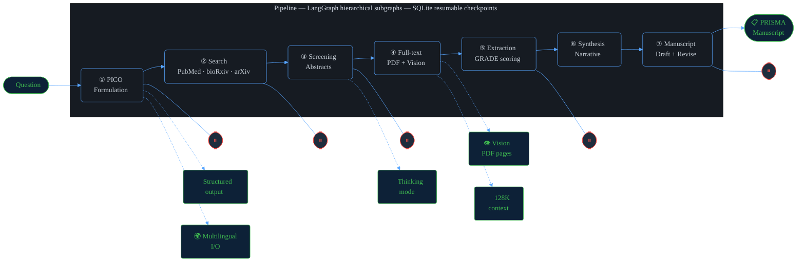
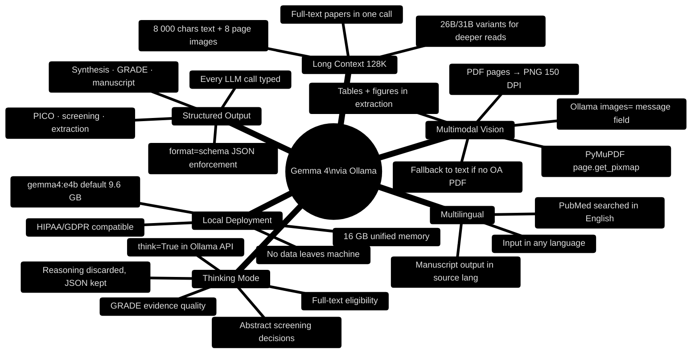
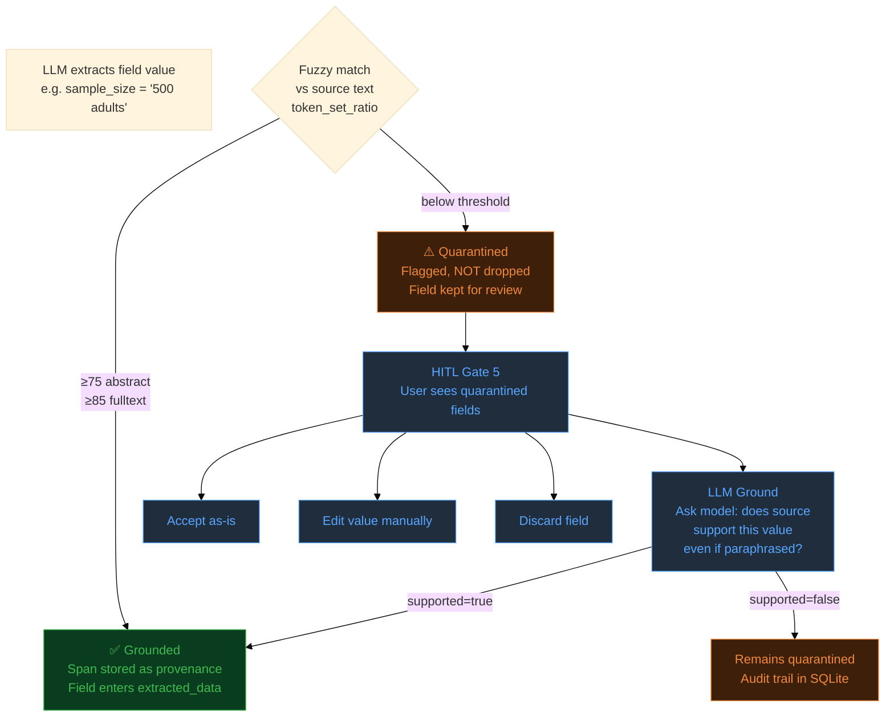

# SLR Agent — Diagrams

Render with any Mermaid-capable viewer (GitHub, mermaid.live, Obsidian, VS Code Mermaid Preview).

---

## 1. Full Architecture Diagram


```mermaid
%%{init: {"theme": "base", "themeVariables": {
  "primaryColor": "#1a1a2e",
  "primaryTextColor": "#e0e0e0",
  "primaryBorderColor": "#4a90d9",
  "lineColor": "#4a90d9",
  "secondaryColor": "#16213e",
  "tertiaryColor": "#0f3460",
  "background": "#0d1117",
  "mainBkg": "#1a1a2e",
  "nodeBorder": "#4a90d9",
  "clusterBkg": "#16213e",
  "titleColor": "#ffffff",
  "edgeLabelBackground": "#1a1a2e",
  "fontFamily": "JetBrains Mono, monospace"
}}}%%

flowchart TB
    %% Input
    Q([🔬 Research Question\n\"Does aspirin reduce BP\nin hypertensive adults?\"])

    %% Stages
    subgraph S1["① PICO Formulation  🧠 think=off · structured output"]
        direction LR
        P1["Translate question\n→ PICO framework"]
        P2["Generate Boolean\nPubMed queries"]
        G1{{"⏸ HITL Gate 1\nEdit PICO + search config"}}
    end

    subgraph S2["② Literature Search  🔍 Entrez + bioRxiv + arXiv (opt-in)"]
        direction LR
        P3["PubMed Entrez\nesearch → efetch"]
        P4["bioRxiv REST API\nhttpx"]
        P4b["arXiv Atom API\nopt-in · httpx"]
        P5["Dedup + store\nSQLite"]
        G2{{"⏸ HITL Gate 2\nExclude / add PMIDs"}}
    end

    subgraph S3["③ Abstract Screening  🧠 think=TRUE · structured output"]
        direction LR
        P6["Generate inclusion/\nexclusion criteria"]
        G3a{{"⏸ HITL Gate 3a\nApprove criteria"}}
        P7["Batch screen\n5 abstracts / LLM call"]
        P8["Fuzzy-ground reasons\nRapidFuzz token_set_ratio"]
        G3b{{"⏸ HITL Gate 3b\nOverride decisions"}}
    end

    subgraph S4["④ Full-text Retrieval  👁️ multimodal · 🧠 think=TRUE"]
        direction LR
        P9["PMC elink\nget PMC ID"]
        P10["efetch XML\nfull text"]
        P11["OA API → download PDF\nPyMuPDF → PNG pages\n150 DPI · max 10 pages"]
        P12["Screen full text\n+ page images\nGemma 4 vision"]
        P12b["Citation network\necho-chamber ratio\ndominant paper detection"]
    end

    subgraph S5["⑤ Data Extraction  👁️ multimodal · structured output"]
        direction LR
        P13["Extract 8 structured\nfields per paper\n+ page image context"]
        P14["GRADE evidence\nquality scoring\n🧠 think=TRUE"]
        P15["Fuzzy-ground all\nextracted fields\nQuarantine on fail"]
        G5{{"⏸ HITL Gate 5\nReview extractions\nLLM ground / edit"}}
    end

    subgraph S6["⑥ Evidence Synthesis  📝 structured output"]
        direction LR
        P16["Narrative synthesis\nwith PMID citations"]
        P17["PRISMA 2020\nflow diagram\nMermaid"]
        P18["Grounding: every claim\nmust cite ≥1 PMID"]
    end

    subgraph S7["⑦ Manuscript Generation  📄 structured output · revision loop"]
        direction LR
        P19["Two-pass draft\nPRISMA template"]
        P20["Rubric scoring\n8 dimensions"]
        G7{{"⏸ HITL Gate 7\nDirect edit / section rewrite\nCustom LLM prompt / full revise"}}
        P21["Export .md + .docx\nPandoc"]
    end

    %% Infrastructure row
    subgraph INFRA["Infrastructure"]
        direction LR
        DB[("SQLite\nPaper store\nQuarantine table\nLangGraph checkpoints")]
        EM["ProgressEmitter\nJSON stage files\noutputs/run_id/"]
        OL["Ollama\ngemma4:e4b  9.6 GB\nLocal · private · no API key"]
        CA["LLMCache\nSHA-256 disk cache\n.llm_cache/ per run"]
        UI["Gradio UI\nper-stage review panels"]
    end

    %% Flow
    Q --> S1
    S1 --> S2
    S2 --> S3
    S3 -->|fetch_fulltext=true| S4
    S3 -->|fetch_fulltext=false| S5
    S4 --> S5
    S5 --> S6
    S6 --> S7
    S7 --> OUT

    OUT([📋 PRISMA Manuscript\n.md + .docx\nAudit trail])

    %% Infrastructure connections
    S1 & S2 & S3 & S4 & S5 & S6 & S7 -.->|state| DB
    S1 & S2 & S3 & S4 & S5 & S6 & S7 -.->|emit| EM
    S1 & S3 & S4 & S5 & S6 & S7 -.->|LLM calls| OL
    S1 & S3 & S4 & S5 & S6 & S7 -.->|cache| CA
    G1 & G2 & G3a & G3b & G5 & G7 -.->|review| UI

    %% Styles
    classDef stage fill:#1a1a2e,stroke:#4a90d9,color:#e0e0e0
    classDef gate fill:#0f3460,stroke:#e94560,color:#ffffff,stroke-width:2px
    classDef io fill:#16213e,stroke:#57cc99,color:#57cc99,stroke-width:2px
    classDef infra fill:#16213e,stroke:#888,color:#aaa
    class S1,S2,S3,S4,S5,S6,S7 stage
    class G1,G2,G3a,G3b,G5,G7 gate
    class Q,OUT io
    class DB,EM,OL,UI infra
```

---

## 2. Pipeline Stages — Clean Overview
*Use for the writeup body or as a secondary media gallery image.*



---

## 3. Gemma 4 Capabilities Map
*Use as a standalone "how we use Gemma 4" slide in the video or media gallery.*



---

## 4. Grounding & Audit Trail
*Use in the video "technical depth" segment.*



---

## Rendering for Screenshots

To get high-quality PNG screenshots for the Media Gallery:

1. **mermaid.live** — paste each diagram, click Export → PNG
2. **VS Code** — install "Mermaid Preview" extension, right-click → export PNG
3. **GitHub** — push this file, view on GitHub (renders automatically), screenshot
4. **CLI** — `npx @mermaid-js/mermaid-cli mmdc -i docs/diagrams.md -o cover.png -b '#0d1117'`

Recommended export settings: width 1280px, background `#0d1117` (dark), scale 2×.
