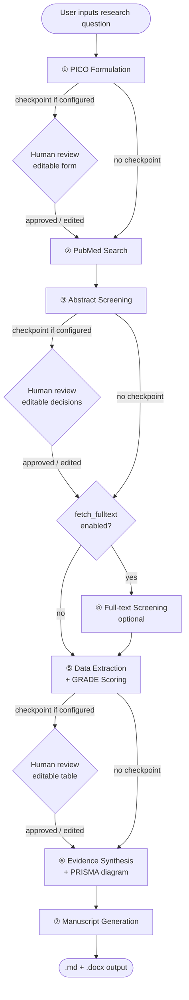

# SLR Agent — Design Specification

**Date:** 2026-04-03  
**Competition:** Kaggle Gemma 4 Good Hackathon  
**Status:** Approved

---

## 1. Overview

A general-purpose Systematic Literature Review (SLR) agent that takes any research question as input, runs a PRISMA-compliant pipeline, and produces a structured manuscript. Runs entirely locally on a Mac Mini using Gemma 4 26B MoE via Ollama. Built with LangGraph hierarchical subgraphs for explicit state machine control, resumability, and traceability.

---

## 2. Decisions & Constraints

| Decision | Choice | Rationale |
|---|---|---|
| Model | Gemma 4 26B MoE (4-bit, ~18GB RAM) via Ollama | Best quality/feasibility on Mac Mini 24GB+; 256K context for full-text |
| Databases | PubMed (Entrez API) + bioRxiv (optional) | PubMed: 35M peer-reviewed papers; bioRxiv: cutting-edge preprints not yet in PubMed |
| Output format | Markdown + Word (.docx via Pandoc) | What researchers actually use |
| Orchestration | LangGraph hierarchical subgraphs | Explicit state machine, built-in checkpoint/resume, interrupt for HITL |
| Interaction surface | CLI core + Gradio UI | CLI is testable/composable; Gradio adds review panels without coupling |
| Multi-language | Input any language → search English → output user's language | Differentiator; Gemma 4 supports 35+ languages natively |
| Scope | General-purpose (user supplies any PICO question at runtime) | More impressive as a tool; validated by smoke test on known question |

---

## 3. Architecture

### 3.1 Layer Diagram

```
┌─────────────────────────────────────────────────────┐
│                   Interface Layer                    │
│   Gradio UI (review panels, progress, export)        │
│   CLI  (slr run / slr resume / slr status / slr export) │
└────────────────────────┬────────────────────────────┘
                         │
┌────────────────────────▼────────────────────────────┐
│            Orchestrator Graph (LangGraph)            │
│   Routes between subgraphs                          │
│   Manages checkpoint interrupts                     │
│   Persists full state to SQLite after every node    │
│   Config: checkpoint_stages, language,              │
│           output_format, fetch_fulltext             │
└────────────────────────┬────────────────────────────┘
                         │
┌────────────────────────▼────────────────────────────┐
│                  Stage Subgraphs                     │
│                                                     │
│  ① PICO        ② Search      ③ Screening            │
│  ④ Full-text*  ⑤ Extraction  ⑥ Synthesis            │
│  ⑦ Manuscript                                       │
│                                                     │
│  * optional — controlled by fetch_fulltext config   │
└────────────────────────┬────────────────────────────┘
                         │
┌────────────────────────▼────────────────────────────┐
│                   Infrastructure                     │
│  Ollama (Gemma 4 26B MoE)   SQLite (checkpointer    │
│  PubMed Entrez API          + paper records)        │
│  PyMuPDF (PDF parsing)      Pandoc (Markdown→Word)  │
└─────────────────────────────────────────────────────┘
```

### 3.2 Stage Subgraphs

| # | Stage | Nodes | Grounding | Default checkpoint |
|---|---|---|---|---|
| ① | PICO | Translate input → Expand PICO → Generate queries → **Validate** | Schema + syntax validation (not provenance) | ✅ pause |
| ② | Search | PubMed Entrez → Deduplicate → Store records | None (pure API) | — |
| ③ | Screening | Batch abstracts → Include/Exclude → **Ground** → PRISMA counts | Extraction grounding | ✅ pause |
| ④ | Full-text | Fetch PMC PDFs → Parse PDF → Screen → **Ground** | Extraction grounding | — |
| ⑤ | Extraction | Extract schema → GRADE scoring → **Ground** | Extraction grounding | ✅ pause |
| ⑥ | Synthesis | Narrative synthesis → PRISMA diagram → **Ground** | Synthesis grounding | — |
| ⑦ | Manuscript | Draft sections → Translate output → Pandoc export | None (assembles grounded claims) | — |

All 7 checkpoint stages are **configurable** (`checkpoint_stages` list in config). The defaults above can be overridden per run.

### 3.3 Pipeline Flow (Mermaid)



---

## 4. State Design

### 4.1 Orchestrator State

The graph state is intentionally slim — it holds routing signals and summary counts only. All bulk evidence lives in SQLite.

```python
class OrchestratorState(TypedDict):
    run_id: str
    config: RunConfig
    pico: PICOResult           # small — kept in state (few fields + query strings)
    search_counts: SearchCounts
    screening_counts: ScreeningCounts   # for PRISMA flow diagram
    fulltext_counts: FulltextCounts | None
    extraction_counts: ExtractionCounts
    synthesis_path: str | None  # path to synthesis .md on disk
    manuscript_path: str | None # path to final .md / .docx on disk
    current_stage: str
    checkpoint_pending: bool
```

### 4.2 PICOResult (in state)

```python
class PICOResult(TypedDict):
    population: str
    intervention: str
    comparator: str
    outcome: str
    query_strings: list[str]    # editable at PICO checkpoint before search runs
    source_language: str        # ISO 639-1 code, e.g. "fr", "en"
    search_language: str        # always "en"
    output_language: str        # same as source_language
```

`query_strings` are editable in the PICO checkpoint panel. User edits are written back into `PICOResult` via `graph.update_state()` before the Search subgraph runs.

### 4.3 Per-Paper Record (SQLite only)

```python
class PaperRecord(TypedDict):
    pmid: str
    run_id: str
    title: str
    abstract: str
    fulltext: str | None
    source: Literal["abstract", "fulltext"]
    screening_decision: Literal["include", "exclude", "uncertain"]
    screening_reason: str
    extracted_data: dict          # structured fields per PICO dimensions
    grade_score: GRADEScore
    provenance: list[Span]        # grounded spans for each extracted field
    quarantined_fields: list[QuarantinedField]
```

```python
class Span(TypedDict):
    pmid: str
    source: Literal["abstract", "fulltext"]
    char_start: int
    char_end: int
    text: str

class QuarantinedField(TypedDict):
    field_name: str
    value: str
    stage: str
    reason: str                   # "no matching span" / "below confidence threshold"

class GRADEScore(TypedDict):
    # Based on GRADE (Grading of Recommendations Assessment, Development and Evaluation)
    certainty: Literal["high", "moderate", "low", "very_low"]
    risk_of_bias: Literal["low", "some_concerns", "high"]
    inconsistency: Literal["no", "some", "serious"]
    indirectness: Literal["no", "some", "serious"]
    imprecision: Literal["no", "some", "serious"]
    rationale: str                # LLM-generated, grounded to extracted fields
```

### 4.4 Config

```python
class RunConfig(TypedDict):
    checkpoint_stages: list[int]   # default [1, 3, 5]
    fetch_fulltext: bool           # default True
    output_format: Literal["markdown", "word", "both"]  # default "both"
    pubmed_api_key: str | None
    max_results: int               # per source, default 500
    search_sources: list[Literal["pubmed", "biorxiv"]]  # default ["pubmed", "biorxiv"]
```

```python
DEFAULT_CONFIG = {
    ...
    "search_sources": ["pubmed", "biorxiv"],
}
```

---

## 5. Grounding Layer

### 5.1 Per-stage grounding mechanism

| Stage | Mode | Implementation |
|---|---|---|
| ① PICO | **Validation** (not provenance grounding) | Schema completeness + PubMed query syntax check |
| ② Search | None | Pure API call |
| ③ Screening | **Extraction grounding** | Fuzzy match of screening reason → abstract span (rapidfuzz) |
| ④ Full-text | **Extraction grounding** | Fuzzy match of screen reason → full-text span |
| ⑤ Extraction | **Extraction grounding** | Fuzzy match of each extracted field value → source span |
| ⑥ Synthesis | **Synthesis grounding** | Gemma 4 verifies each claim is supported by cited PaperRecords |
| ⑦ Manuscript | None | Assembles already-grounded claims only |

### 5.2 Extraction Grounding (stages ③④⑤)

Each LLM-extracted field value is fuzzy-matched against the source text (abstract or full-text). Match threshold: 85 (rapidfuzz token_sort_ratio). On match, the span `(char_start, char_end, text)` is stored as provenance. On failure, the field is **quarantined** — not dropped.

```
extracted_field_value ──fuzzy_match──▶ source_text
                              ├── score ≥ 85 → GroundedField(span=Span(...), status="grounded")
                              └── score < 85 → GroundedField(span=None, status="quarantined")
                                                → written to quarantine table in SQLite
```

### 5.3 Synthesis Grounding (stage ⑥)

For each synthesised claim, Gemma 4 is called with:
- The claim text
- The set of `PaperRecord` extractions it was derived from

It must return a list of `pmid` values that support the claim. Claims with zero citations are quarantined.

### 5.4 Quarantine Behaviour

- Quarantined items are written to a `quarantine` SQLite table (field, value, stage, reason)
- They do **not** propagate to downstream stages
- At each checkpoint panel, quarantined items are surfaced for manual resolution: **accept-as-is**, **edit**, or **discard**
- PRISMA flow diagram includes quarantine counts as a data quality signal
- Full audit trail is available via `slr status <run_id>`

---

## 6. Human-in-the-Loop Checkpoints

### 6.1 Mechanism

LangGraph `interrupt()` is called at the end of each configured checkpoint stage. The Gradio UI (or CLI) presents the stage output as an **editable form**, not a binary approve/reject. The user edits any fields they disagree with, then submits. The edited values are written back via `graph.update_state(thread_id, edited_state)` before `graph.invoke(None, ...)` resumes execution.

### 6.2 Per-stage checkpoint panels

| Stage | Editable fields in panel |
|---|---|
| ① PICO | P / I / C / O fields; query strings (add/remove/edit); detected language |
| ③ Screening | Include/exclude decision per paper; reason text |
| ④ Full-text | Include/exclude decision per paper; reason text |
| ⑤ Extraction | Extracted field values per paper; GRADE score; quarantined items |
| ⑥ Synthesis | Narrative synthesis text; quarantined claims |
| ⑦ Manuscript | Full draft sections (Methods, Results, Discussion) |

---

## 7. Error Handling

### 7.1 LLM failures (Ollama timeout, OOM, malformed JSON)

- Retry with exponential backoff, max 3 attempts
- Structured JSON output enforced via Gemma 4 function-calling mode; malformed output triggers a correction-prompt retry
- After 3 failures: write checkpoint, set `current_stage = "failed"`, surface error in Gradio/CLI
- `slr resume <run_id>` re-enters at the failed node

### 7.2 PubMed API failures (rate limit, network timeout)

- Rate limiter: 3 req/s without API key, 10 req/s with key
- 429/503: backoff + retry
- Persistent failure: write partial results to SQLite, pause at next checkpoint with warning
- Partial results are usable — pipeline continues with what was retrieved

### 7.3 PDF parsing failures

- Per-paper failure, not a stage failure
- Paper `source` falls back to `"abstract"`, noted in `PaperRecord`
- Stage continues processing remaining papers

---

## 8. CLI Interface

```
slr run "<research question>"     # start new run, returns run_id
slr resume <run_id>               # resume from last checkpoint (idempotent)
slr status <run_id>               # show stage, counts, quarantined items
slr export <run_id>               # export manuscript from completed run
```

`slr resume` is safe to call even if the run didn't fail — if at a checkpoint it surfaces the review panel; if mid-stage it re-enters from last saved state.

---

## 9. Testing Strategy

### 9.1 Unit tests (no Ollama required)
Each node tested with fixture inputs. LLM calls replaced by `MockLLM` returning pre-canned structured outputs. Fast, runs in CI.

### 9.2 Integration tests (Ollama required)
Each subgraph run end-to-end against a small fixed dataset (10–20 real PubMed records stored as fixtures). Uses real SQLite checkpointer. Validates typed state output, grounding pass/fail, checkpoint/resume within the subgraph.

### 9.3 End-to-end smoke test (manual)
Full pipeline run on a known question (e.g., "aspirin for cardiovascular prevention"), capped at 50 PubMed results. Validates orchestrator routing, all checkpoint interrupts, PRISMA counts, and manuscript export. Run manually before submission.

### 9.4 Grounding regression test (critical)
Fixture test that injects a `PaperRecord` with a deliberately hallucinated extracted field (no matching span in source). Verifies the grounding node quarantines it — not passes it. This is the key safety property of the system.

---

## 10. Technology Stack

| Component | Technology |
|---|---|
| LLM runtime | Ollama — Gemma 4 26B MoE (4-bit, ~18GB RAM) |
| Orchestration | LangGraph (hierarchical subgraphs, SQLite checkpointer) |
| Search | PubMed Entrez (Biopython `Entrez`) + bioRxiv API (httpx) |
| PDF parsing | PyMuPDF |
| Fuzzy matching | rapidfuzz |
| Grounding / JSON | Gemma 4 function-calling mode |
| UI | Gradio |
| Export | Pandoc (Markdown → .docx) |
| State storage | SQLite (LangGraph checkpointer + PaperRecord store) |
| Language | Python 3.11+ |
| PRISMA diagram | Mermaid |

---

## 11. Out of Scope

- Databases other than PubMed and bioRxiv (Embase, Cochrane, Semantic Scholar)
- Statistical meta-analysis / forest plots (GRADE scoring only)
- LaTeX output
- Cloud LLM fallback
- Multi-user / collaborative review
